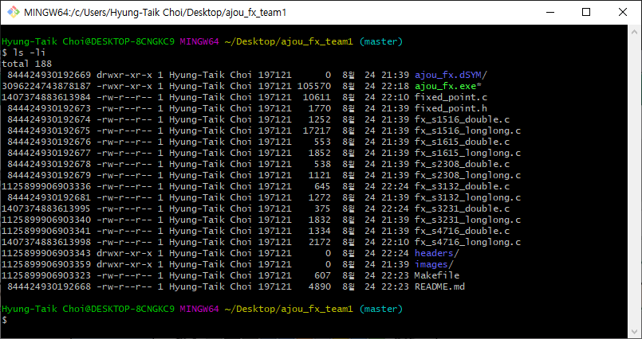

# Project: Device Control for Embedded Systems
## Raspberry Pi CPU
The name of the physical core of a Raspberry Pi BCM2837 is ARMv6 Cortex A53.  

## GPIO
GPIO ports have many names.
- BCM: Broadcom
- wPi: wiringPi
- Physical

The port numbers of wiringPi are set as the default name for ports, but users can change to BCM using gpio -g.  
For example, `gpio -g read 18` and `gpio read 1` is equal.

## Extracurricular Material on i-nodes from Prof. Lee
Linux manages files by allocating a unique `i-node` number to every file.  
Linking a file makes a mirror of the file, but displays as different files.  
 
Use ls -li to see inode number.

One can make symbolic links using the command `ln -s target.c symbolic_link.c`

Also, the command `more` has more performance impact that `less`.

