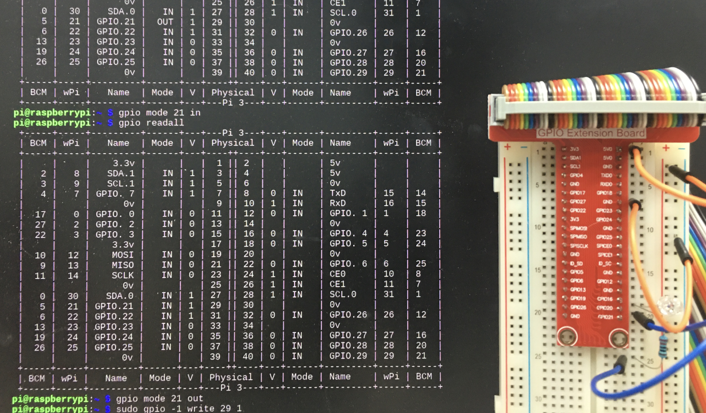

# Project: Device Control for Embedded Systems
## Raspberry Pi CPU
The name of the physical core of a Raspberry Pi BCM2837 is ARMv6 Cortex A53.  

## GPIO
GPIO ports have many names.
- BCM: Broadcom
- wPi: wiringPi
- Physical

The port numbers of wiringPi are set as the default name for ports, but users can change to BCM using gpio -g.  
For example, `gpio -g read 18` and `gpio read 1` is equal.

## Project Result
