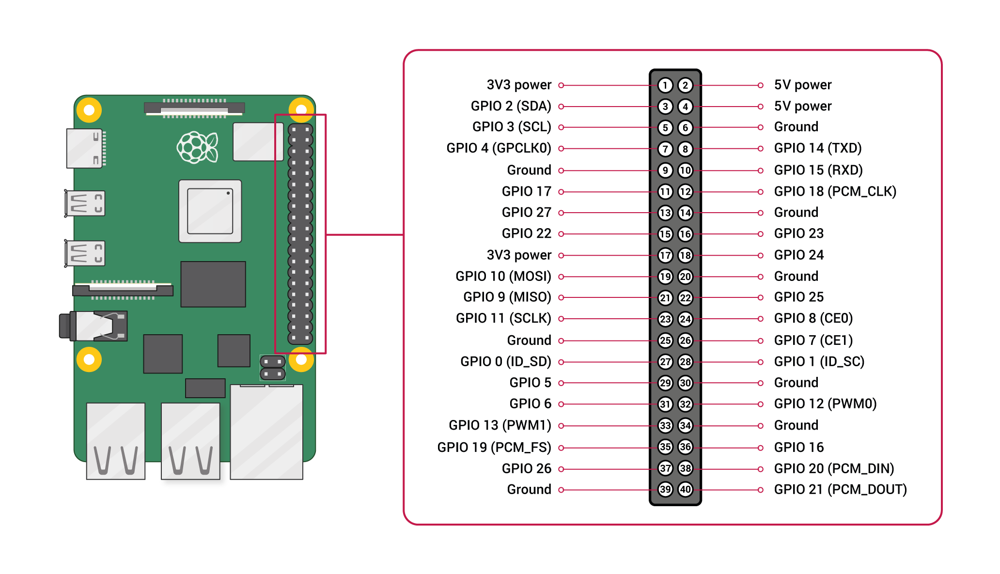
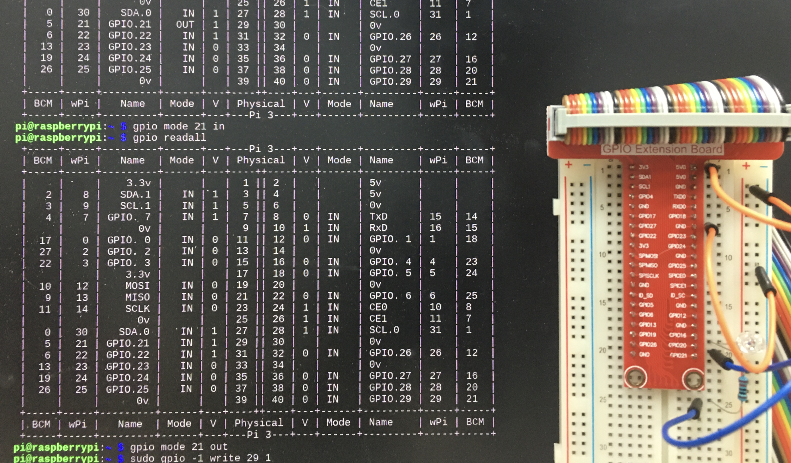

# Project: Raspberry Pi and GPIOs
## Raspberry Pi
- It is a microcomputer designed to boost computer science education.
- It is cheap but powerful.
- Uses an ARM processor and Raspbian, a Debian distribution, as the default OS.

## GPIO
- GPIO stands for General Purpose Input Output.

## Project Result

