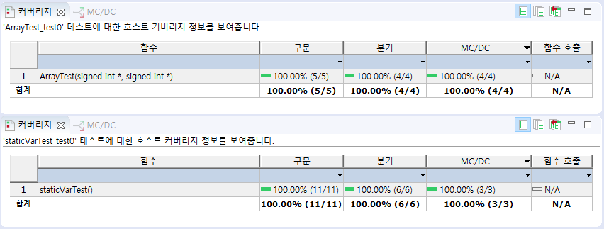

## Errors
Syntax or Semantic

# battle_c
Maintainer: Hyung-Taik Choi

# Project: Software Testing
## Basic Terminology
### Mission Critical
- Mission Critical: Software that can bring catastrophical results when a small error exists.

### Dynamic Testing vs Static Testing
- Dynamic Testing: Testing performed while running an executable of the code.
- Static Testing: Testing performed while not running an executable of the code.

### Black Box Testing vs White Box Testing
- Black Box(Behavioral Testing): A software testing method in which the internal structure is not disclosed, hence not known to the tester.
- Whilte Box(Structural Testing): A software testing method in which the internal structure is disclosed, hence known to the tester.

| Criteria | Black Box Testing |  White Box Testing |
| --- | --- | --- |
| Levels Applicable To | Mainly applicable to higher levels of testing: Acceptance Testing & System Testing | Mainly applicable to lower levels of testing: Unit Testing & Integration Testing |
| Responsibility | Generally, independent Software Testers | Generally, Software Developers |
| Programming Knowledge | Not Required | Required |
| Implementation Knowledge | Not Required | Required |
| Basic for Test Cases | Requirement Specifications | Detail Design |

## Project Result
### MISRA-C 2012 Conformity Test

Initial Error Count: 94 items
Final Error Count: 0 items

### Coverage Test

