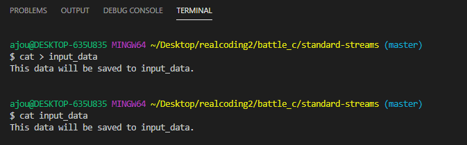
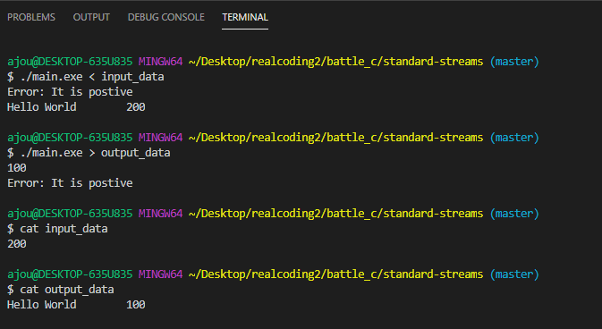
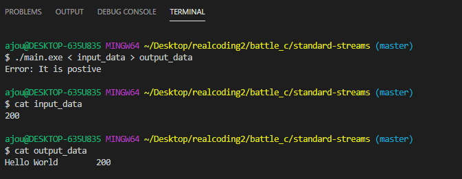
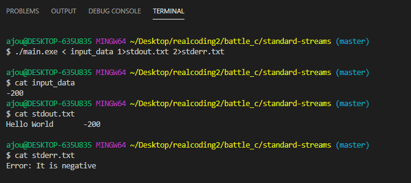

# Project: Standard Streams
## Standard Streams
> In computer programming, **standard streams** are interconnected input and output communication channels between a computer program and its environment when it begins execution. *- Standard Streams (Wikipedia)*

1. Standard Input (stdin : 0)
- `stdin` is a stream from which a program reads its input data.
- Not all programs require stream input(*i.e.*, `ls`, doesn't require an input stream).
- Unix, by default, automatically associates the terminal keyboard as standard input.

2. Standard Output (stdout : 1)
- `stdout` is a stream from which a program writes its output data.
- Not all programs require stream output(*i.e.*, `mv`, doesn't require an output stream).
- Unix, by default, automatically associates the terminal display as standard output.

3. Standard Error (stderr : 2)
- `stderr` is a stream from which a program writes its error messages or diagnostics.
- It is independent of `stdout`. 
- It is acceptable and conventional to direct both standard output and standard error to the same destination, such as a terminal display.   

4. Redirections
- Before a command is executed, its input and output may be redirected using a special notation interpreted by the shell.
    - `>`: Redirecting output
    - `>>`: Appending redirected output
    - `<`: Redirected input
- Usage Examples
    - `cat input_data`: Prints `input_data` to terminal display
    - `cat > input_data`: `stdin` is redirected to `cat::stdin`, `cat::stdout` is redirected to `input_data`.
    
    - `./main.exe < input_data`: `input_data` is redirected to `main.exe::stdin`.
    - `./main.exe > output_data`: `main.exe::stdout` is redirected to `output_data`.
    
    - `./main.exe < input_data > output_data`: `input_data` is redirected to `main.exe::stdin` while `main.exe::stdout` is redirected to `output_data`.  
    
    - `./main.exe <input_data 1>stdout.txt 2>stderr.txt`: `input_data` is redirected to `main.exe::stdin` while `main.exe::stdout` is redirected to `stdout.txt` and `main.exe::stderr` is redirected to `stderr.txt`.  
    

## Project Result

1. Compile as `main.exe` using `gcc hello.c`.
2. Run using `./main.exe <input_data 1>stdout.txt 2>stderr.txt`
3. Check result.
4. Below codes yield equal results.
    - `./main.exe 0<input_data 1>stdout.txt 2>stderr.txt`
    - `./main.exe <input_data 1>stdout.txt 2>stderr.txt`